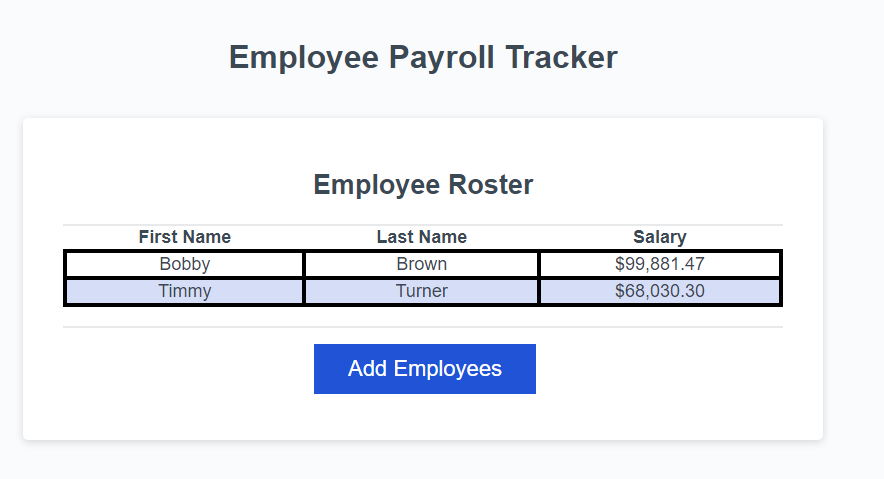
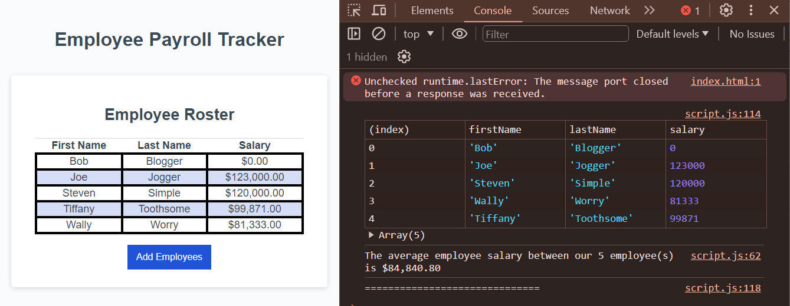
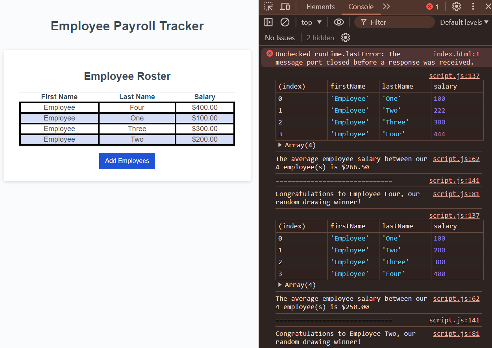

# Employee Payroll Tracker

This repository contains source code for JavaScript functions that have been built upon provided starter code, for the Week 3 Bootcamp Challenge. The source code contains 3 functions that has been requested to add further functionality for a payroll tracking webpage.

1. Collecting employee(s) data (`collectEmployees`):
   - First Name (`.firstName`)
   - Last Name (`.lastName`)
   - Salary (`.salary`)
2. Logging company wide salary averages (`displayAverageSalary`)
3. Selecting a random employee from data, and logging a congratulatory message (`getRandomEmployee`).

## Additional Resources
In addition to the base starter code provided in this project, many functions were extracted from external sources:

- Extracting values of an array into values (`collectEmployees`): https://stackoverflow.com/questions/19590865/from-an-array-of-objects-extract-value-of-a-property-as-array
- Total sum of all values in a number array (`displayAverageSalary`): https://www.freecodecamp.org/news/how-to-add-numbers-in-javascript-arrays/
- Random array index generator (`getRandomInt`): https://developer.mozilla.org/en-US/docs/Web/JavaScript/Reference/Global_Objects/Math/random

## Deploy

The final webpage for this can be accessed here: https://kevinvongmany.github.io/employee-payroll-tracker/.

Users can access the HTML source code through the repo or in a browser DevTools within a Chromium/Firefox browser by pressing `F12`, `CTRL+SHIFT+I` (Windows) or `CMD+SHIFT+I` (MacOS). The console DevTools should also display the required functionality, as per the samples below.

## Samples

Samples for the employee payroll tracking webpage and its required functionality can be found here:

### Collecting employee data


### Displaying average salaries


### Randomly selecting employee


## JavaScript Development

This week's Challenge requires you to modify starter code to create an application that enables a payroll manager to view and manage employee payroll data. This app will run in the browser and will feature dynamically updated HTML and CSS powered by JavaScript code that you write. It will have a clean and polished, responsive user interface that adapts to multiple screen sizes.

## User Story

```md
AS A payroll manager
I WANT AN employee payroll tracker
SO THAT I can see my employees' payroll data and properly budget for the company
```

## Acceptance Criteria

```md
GIVEN an employee payroll tracker
WHEN I click the "Add employee" button
THEN I am presented with a series of prompts asking for first name, last name, and salary
WHEN I finish adding an employee
THEN I am prompted to continue or cancel
WHEN I choose to continue
THEN I am prompted to add a new employee
WHEN I choose to cancel
THEN my employee data is displayed on the page sorted alphabetically by last name, and the console shows computed and aggregated data
```

## Mock-Up

The following images show the web application's appearance and functionality:


## Getting Started

You will be responsible for filling out the following functions:

* `collectEmployees`: This function will allow a user to add multiple employees to display on the page.  The user will need to enter the first name, last name, and salary of each employee, then have the option to keep adding employees until they choose to stop. A `while` loop will be needed here ([MDN Web Docs on `while` loops](https://developer.mozilla.org/en-US/docs/Web/JavaScript/Reference/Statements/while)) The salary will need to be entered as a number, otherwise it should default to $0.  The `isNaN` function can help with this: ([MDN Web Docs on isNaN](https://developer.mozilla.org/en-US/docs/Web/JavaScript/Reference/Global_Objects/isNaN)) This function should return an array of objects, like the following example.  Reference the [MDN Web Docs on return](https://developer.mozilla.org/en-US/docs/Web/JavaScript/Reference/Statements/return):

```javascript
    [
        {
            firstName:"John",
            lastName:"Smith",
            salary:12345
        },
        {
            firstName:"Jane",
            lastName:"Doe",
            salary:54321
        }
    ]
```

* `displayAverageSalary`: This function will take in the generated array of employees and log the average salary and number of employees to the console.  You should use a template literal string for this task.

* `getRandomEmployee`: This function will take in the generated array of employees, randomly select one employee, and use a template literal to log their full name to the console.  The built in `Math` object can help with random number generation: ([MDN Web Docs on `Math.random`](https://developer.mozilla.org/en-US/docs/Web/JavaScript/Reference/Global_Objects/Math/random))

The provided starter code includes the `displayEmployees` and `trackEmployeeData` functions. These functions are complete and working. You do not have to modify any code for the following functions:

* `displayEmployees`: This function will take in an array of employees and render each employee to an HTML table.

* `trackEmployeeData`: This function will execute when the "Add Employees" button is clicked. It will take the array generated in your `collectEmployees` function, sort the employees by last name, and place them on a table on the page using the provided `displayEmployees` function.  Additionally, the function will execute the `displayAverageSalary` function to log the average employee salary to the console, and execute the `getRandomEmployee` function to log a random employees information to the console.

This is an autograded assignment, meaning that you will follow the link below to open the assignment in a new window in the Ed platform. You will modify the existing starter code files to meet the requirements listed below.

> **note** If you need any assistance with the Ed platform, please review the information on submitting assignments in Module 0.

## Grading Requirements

This Challenge is graded based on the following criteria:

### Function to Collect Employees 40%

* The `collectEmployees()` function must do the following:

  * creates a new employee object by collecting first name, last name, and salary using `prompt()` (20 points)

  * creates multiple employee objects by collecting first name, last name, and salary for each employee using `prompt()` and `confirm()` (20 points)

### Function to Display Average Salary 30%

* The `displayAverageSalary()` function must do the following:

  * calculates the average salary and logs "The average employee salary between our <numberOfEmployees> employee(s) is $<averageSalaryWithTwoDecimals>" when given salaries with no decimals (15 points)

  * calculates the average salary and logs "The average employee salary between our <numberOfEmployees> employee(s) is $<averageSalaryWithTwoDecimals>" when given salaries with decimals (15 points)

### Function to Choose a Random Drawing Winner 30%

* The `getRandomEmployee()` function should do the following:

  * chooses an employee at random and logs "Congratulations to <employeeFirstName> <employeeLastName>, our random drawing winner!" (15 points)

  * random selection method should allow for all employees to be chosen in the drawing (15 points)
